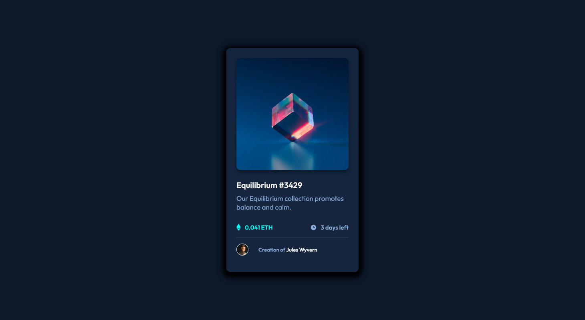
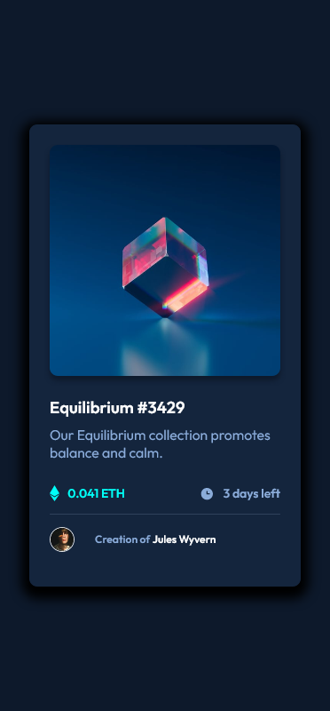

# Frontend Mentor - NFT preview card component solution

This is a solution to the [NFT preview card component challenge on Frontend Mentor](https://www.frontendmentor.io/challenges/nft-preview-card-component-SbdUL_w0U). Frontend Mentor challenges help you improve your coding skills by building realistic projects.

## Table of contents

- [Overview](#overview)
  - [The challenge](#the-challenge)
  - [Screenshot](#screenshot)
  - [Links](#links)
- [My process](#my-process)
  - [Built with](#built-with)
  - [What I learned](#what-i-learned)
- [Author](#author)
- [Acknowledgments](#acknowledgments)

## Overview

### The challenge

Users should be able to:

- View the optimal layout depending on their device's screen size
- See hover states for interactive elements

### Screenshot




### Links

- Solution URL: [Add solution URL here](https://your-solution-url.com)
- Live Site URL: [Add live site URL here](https://your-live-site-url.com)

## My process

### Built with

- Semantic HTML5 markup
- CSS custom properties
- Flexbox

### What I learned

This is my second challenge, and to my surprise I learned more than my first challenge. I was asked to use smantic tags of HTML5 with good code practice, and I guess I have done it.
Also avoided usage of px and rem was used in whole project with font-size of 62.5%.
For this project, I got to know how to set an absoute child to it's parent div, was really a headache, and searched a lot for it, but was done at last.

Some of the lines which really make me feel happy that I did them myselves:

```html
<section class="inner-image">
  
  <section class="image-overlay">
    
  </section>
</section>
```

```css
.image-overlay {
  position: absolute;
  display: flex;
  justify-content: center;
  align-items: center;
  width: 28rem;
  height: 28rem;
  top: 0;
  left: 0;
  background: var(--Cyan);
  opacity: 0;
  border-radius: 1rem;
}
```

## Author

- Frontend Mentor - [PriyanshuSaxena2612](https://www.frontendmentor.io/profile/PriyanshuSaxena2612)
- Twitter - [Priyanshu_1310](https://www.twitter.com/Priyanshu_1310)

## Acknowledgments

I would like to give my thanks to [@Remus432](https://www.frontendmentor.io/profile/Remus432) who helped me in pointing out the major mistakes in my previous challenge, because of which I think I might have improved in this challenge.
